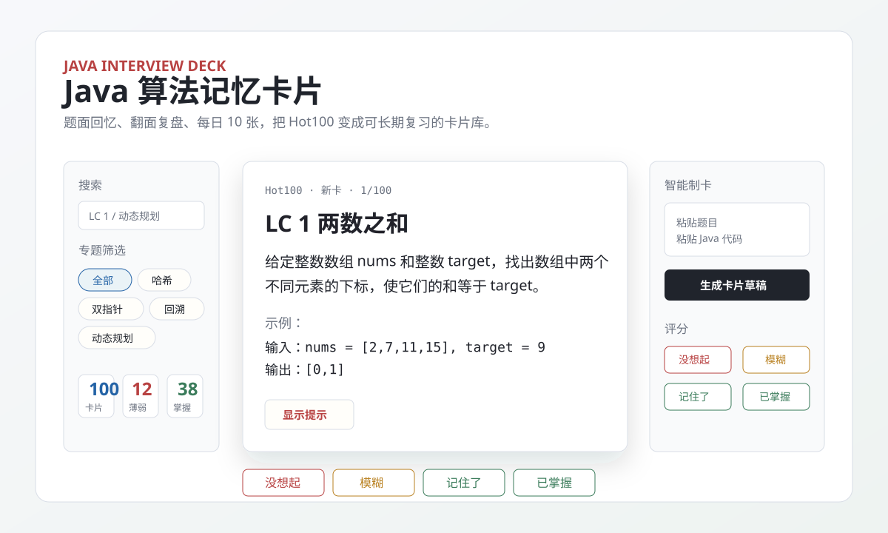

# Java 算法记忆卡片

一个本地优先的 Java 算法 Anki 式记忆卡片工具，适合系统复习 LeetCode Hot100、代码随想录和高频面试题。



## 项目简介

这个项目把算法题做成“题面 -> 回忆 -> 翻面 -> 评分”的记忆卡片。正面只展示清晰题面和示例，不提前暴露解法类型；翻面后再查看精简思路、复杂度、详细复盘和 Java 代码。

它更像一个为算法面试准备定制的本地复习台：内置完整 Hot100 卡池和“卡面熟悉”练习集合，支持搜索、集合筛选、专题筛选、随机抽卡、每日 10 张复习、薄弱题优先、编辑删除卡片、本地保存进度，以及 DeepSeek 智能制卡。

智能制卡功能通过本地 Node 服务调用 DeepSeek API。API Key 只放在本地 `.env` 或环境变量中，不会在页面里输入，也不会提交到 Git。

## 在线访问

- 项目介绍页：<https://for5634.github.io/java-algorithm-memory-cards/>
- 在线复习工具：<https://for5634.github.io/java-algorithm-memory-cards/app.html>

在线版可以阅读和复习内置 Hot100 卡片，也能把复习进度保存到当前浏览器。DeepSeek 智能制卡需要本地服务代理，因此请克隆项目并在本地运行。

## 适合谁

- 正在准备 Java 后端算法面试的人
- 想系统刷 LeetCode Hot100 的人
- 想把代码随想录专题整理成长期复习卡的人
- 想把错题、薄弱题沉淀成本地知识库的人

## 功能特性

- 内置 LeetCode Hot100 卡片
- 内置“卡面熟悉”集合，用来练习主动回忆、题面拆解、边界自检和常见算法表达
- 每张内置卡包含题面、示例、Java 解法、复杂度和详细复盘
- Anki 式翻面复习
- 提示默认隐藏，手动点击后才显示
- 搜索、集合筛选、专题筛选、薄弱卡筛选、自定义卡筛选
- 随机抽卡
- 每日抽 10 张复习，直到抽完整个卡池
- 评分：没想起、模糊、记住了、已掌握
- 已掌握卡片自动后移，薄弱卡优先
- 新增、编辑、删除卡片
- 恢复内置卡片
- 本地保存复习进度
- 导入/导出卡片和进度 JSON
- 本地 Prism 风格 Java 代码高亮
- DeepSeek 智能制卡：粘贴题目和 Java 代码，自动生成卡片草稿

## 快速启动

### 方式一：双击启动

在 Windows 中双击：

```text
start-cards.bat
```

它会启动本地服务，并打开：

```text
http://localhost:8787/app.html
```

### 方式二：命令行启动

```powershell
cd memory-cards
node server.js
```

然后打开：

```text
http://localhost:8787/app.html
```

### 方式三：只使用复习功能

如果不需要智能制卡，也可以直接打开：

```text
index.html
```

直接打开 HTML 时可以复习、筛选、编辑和保存本地进度，但不能调用 DeepSeek 智能制卡接口。

## DeepSeek API Key 配置

复制示例文件：

```powershell
copy .env.example .env
```

然后编辑 `.env`：

```text
DEEPSEEK_API_KEY=你的 DeepSeek API Key
```

也可以使用环境变量：

```powershell
$env:DEEPSEEK_API_KEY="你的 DeepSeek API Key"
node server.js
```

注意：`.env` 已在 `.gitignore` 中忽略，不会被提交。

## DeepSeek 智能制卡规范

智能制卡会尽量生成可以直接复习的完整卡片，而不是只给一个代码模板。默认要求如下：

- 标题使用 `LC 题号 题目名` 格式，例如 `LC 11 盛最多水的容器`
- 题面必须描述清楚输入、输出目标、约束关系或返回值要求
- 题面必须包含 1 个示例，并写出 `输入：` 和 `输出：`
- 题面不提前暴露解法类型，不写“双指针”“动态规划”“滑动窗口”等提示词
- 提示只给轻量观察，不直接泄露方法
- 答案面包含精简思路、详细复盘、复杂度和 Java 代码

生成后内容会先填入表单，你可以手动修改满意后再保存。

## 快捷键

- `F`：翻面
- `R`：随机抽卡
- `1`：没想起
- `2`：模糊
- `3`：记住了
- `4`：已掌握

## 数据保存

卡片修改、复习进度、每日复习记录会保存在当前浏览器的 `localStorage` 中。换电脑或换浏览器前，建议先在“数据”页导出 JSON。

## 同步到手机

电脑端本地运行 `node server.js` 后，打开 `http://localhost:8787/app.html`，进入“数据”页并点击“生成手机同步二维码”。手机和电脑连接同一 Wi-Fi 后，用手机扫码即可把电脑当前浏览器里的自定义卡片、修改记录、删除记录、复习进度和每日复习记录导入手机浏览器。

同步二维码 10 分钟内有效，数据只临时保存在电脑本机 Node 服务内存中，不会上传云端，也不会包含 `.env` 或 DeepSeek API Key。如果扫码打不开，优先检查手机和电脑是否在同一 Wi-Fi、防火墙是否允许访问端口 `8787`，也可以在页面里切换备用局域网地址后重新扫码。

## 技术栈

- HTML
- CSS
- Vanilla JavaScript
- Node.js 本地静态服务和 DeepSeek API 代理

## 适用场景

- Java 算法面试准备
- LeetCode Hot100 系统复习
- 代码随想录专题复盘
- 把自己的错题整理成可长期回顾的记忆卡片
